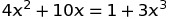

### Computer Modelling in Chemical Technology, 2020 Edition

## Class 02 - Scilab basics, 4 May - 10 May

### Warming up exercise

In the most cases a very convenient way of using Scilab is writing commands into a file called "script". The script is a simply text file, which could be loaded/saved/send, or edited via a text editor, even by notepad. Scilab could load & execute the script.

Watch the video: https://www.youtube.com/watch?v=cUzBX7H2fi4

Visit the page: https://www.wolframalpha.com/input/?i=x%5E2%3D16

Try to plot a similar graph using Scilab.
Load the script [script01.sce](https://raw.githubusercontent.com/sbednarz/scilab/master/2020/02/script01.sce), and try to understand line-by-line the code.
Go to the console, and type `x <ENTER>` or use the variable browser to inspect x content. What is role of "linspace" function? `help linspace` under the console could help.
Please remember that command `clf` clear plotting area, whereas `clear` clear scilab memory. Both functions are usefull.


### Introduction: User-defined functions

Study tutorials:

https://www.scilab.org/sites/default/files/Scilab_beginners_0.pdf page 12, 13

[x-engineer.org](https://x-engineer.org/graduate-engineering/programming-languages/scilab/how-to-define-a-custom-function-in-scilab/)- the general description

https://mars.uta.edu/mae3183/simulation/introscilab_baudin.pdf pages 38, 39, 42

and the video:

https://www.youtube.com/watch?v=ZEa2xOXwrJs

##### Example 1

Create a new script in Scilab/Scinotes, copy and paste the code, and run the script:

```scilab
// fun1 => a function name
// y => return value

function y = fun1 (x)
	y = x + 2
endfunction


// using of functions

a = 10
b = fun1(a)
disp(b)

disp(fun1(10))
```

Follow the code line-by-line, and try to understand. 
Play with the code to see what happened.


##### Example 2

Here is an example of function for calculation of the formula:


Create a new script in Scilab, copy and paste the code, and run the script:

Approach 1 (all-in-one):

```scilab
function y = fun2 (x)
	y = x^2 + 1
endfunction

disp(fun2(10))
// 101
```

Approach 2 (step-by-step):

```scilab
function y = fun2 (x)
	a = 2       // a local variable as a parameter
	b = 1       // a local variable as a parameter
	z = x^a
	y = z + b
endfunction

disp(fun2(10))
// 101
```

Try to modify the script to calculate expression:


##### Example 3

Please remember that the functions could accept more than one argument:

```scilab

// function of two arguments
function z = calculate(x,y)
	z = x+y
endfunction

disp(calculate(10,20))
//30
```

##### Example 4

Vectors & matrices could be functions arguments/results.
In the following example, both x and y are two-elements vectors.

```scilab
// vectors & matrices as functions arguments/results
function y = fun3 (x)
	a = x(1)      // the first element of x
	b = x(2)      // the second element of x
	y(1) = a+b    // calculate & put the result to the first elemenent of vector y
	y(2) = a-b    // calculate & put the result to the second elemenent of vector y
endfunction

// creation of argument vector
v = [10,2]

// calculations (using function fun3)
q = fun3(v)

// q is a vector with the results: q(1)<=y(1) q(2)<=y(2)

disp(q)
// 12
// 8

disp(fun3(v))
// 12
// 8
```

### Introduction: numerical solving system of nonlinear equations

Please browse the official documentation: https://help.scilab.org/docs/6.1.0/en_US/fsolve.html

Navigate to https://www.wolframalpha.com/input/?i=x%5E2%3D16

and next, study the following materials:

```scilab
// https://www.wolframalpha.com/input/?i=x%5E2%3D16

// x^2=16
// re-arrange the equation:
// x^2-16=0
// and put the left side to the function body

function eq = problem(x)
    eq = x^2 - 16
endfunction

// initial guess value
guess = 100

// main calculations
x0 = fsolve(guess, problem)

// results
disp(x0)
```

https://www.youtube.com/watch?v=jwQlY0BE0kg

and worked examples (copy, paste to Scinotes & execute; play with guess values):

https://github.com/sbednarz/scilab/tree/master/01#example-16-fsolve


Note: in real calculations we have knowledge (we should have) about expected solutions. For example, as chemists, we know that temperature must be in a range from c.a. 100K to, let say, 2000K (in most problems). It helps a lot to set initial guess value, and to evaluate correctness of calculations. 


Compare Scilab code and Wolfram Alpha calculations:

https://www.wolframalpha.com/input/?i=x%5E2%2By%3D16%2C+x%3D10-y+

```scilab
//https://www.wolframalpha.com/input/?i=x%5E2%2By%3D16%2C+x%3D10-y+

// Nonlinear equations system
// 1) x^2 + y = 16
// 2) x = 10 - y
// two equations, two unknowns

// var is a two-element vector
// eq is also a two-element vector
function eq = problem(var)
    x = var(1)
    y = var(2)
    eq(1) = x^2 + y - 16
    eq(2) = x - 10 + y 
endfunction


// try 10;10 or -10;-10
guess = [-10;-10]     // semicolon here, NOT comma

solution = fsolve(guess, problem)
disp(solution)
```


### Exercise 1

Create a new script. Define a funtion to calculate density of water at various temperature, rho=f(T):
https://www.ncbi.nlm.nih.gov/pmc/articles/PMC4909168/ eq. 3.
Plot water density for temperature range from 5 to 40oC.

### Exercise 2

Solve equation:



Report all solutions.

### Exercise 3

Solve system of two equations:


Report all solutions.


*Please send back Scilab scripts (Exercise 1, 2 and 3) with solutions.*


#### Summary

User defined functions, `fsolve` function

