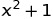

### Computer Modelling in Chemical Technology, 2020 Edition

## Class 02 - Scilab basics, 4 May - 10 May

#### Warming up exercise

In the most cases a very convenient way of using Scilab is writing commands into a file called "script". The script is a simply text file, which could be load/save/sent, or edit via a text editor, even by notepad. Scilab could load & execute the script.

Watch the video: https://www.youtube.com/watch?v=cUzBX7H2fi4

Visit the page: https://www.wolframalpha.com/input/?i=x%5E2%3D16

Try to plot a similar graph using Scilab.
Load the script [script01.sce](https://raw.githubusercontent.com/sbednarz/scilab/master/2020/02/script01.sce), and try to understand line-by-line the code.
Go to the console, and type `x <ENTER>` or use the variable browser to inspect x content. What is role of "linspace" function? `help linspace` under the console could help.
Please remember that command `clf` clear plotting area, whereas `clear` clear scilab memory. Both functions are usefull.


#### Introduction: User-defined functions

Study tutorials:

https://www.scilab.org/sites/default/files/Scilab_beginners_0.pdf page 12, 13

[x-engineer.org](https://x-engineer.org/graduate-engineering/programming-languages/scilab/how-to-define-a-custom-function-in-scilab/)- the general description

https://mars.uta.edu/mae3183/simulation/introscilab_baudin.pdf pages 38, 39, 42

and the video:

https://www.youtube.com/watch?v=ZEa2xOXwrJs

##### Example 1

Create a new script in Scilab/Scinotes, copy and paste the code, and run the script:

```scilab
// fun1 => a function name
// y => return value

function y = fun1 (x)
	y = x + 2
endfunction


// using of functions

a = 10
b = fun1(a)
disp(b)

disp(fun1(10))
```

Follow the code line-by-line, and try to understand. 
Play with the code to see what happened.


##### Example 2

Here is an example of function for calculation of the formula:



Create a new script in Scilab, copy and paste the code, and run the script:

```scilab
function y = fun2 (x)
	z = x**2
	y = z + 1
endfunction

disp(fun2(10))
// 101
```

Try to modify the script to calculate expression:


##### Example 3

Please remember that the functions could accept more than one argument:

```scilab

// function of two arguments
function z = calculate(x,y)
	z = x+y
endfunction

disp(calculate(10,20))
//30
```

#### Exercise 1

Create a new script. Define a funtion for calculation of:


```scilab
// vectors & matrices as functions arguments/results
function y = fun3 (x)
	a = x(1)
	b = x(2)
	y(1) = a+b
	y(2) = a-b
endfunction

v = [10,2]
q = fun3(v)

// q is a vector

disp(fun3(v))
// 12
// 8
```


Scilab user - defined functions


