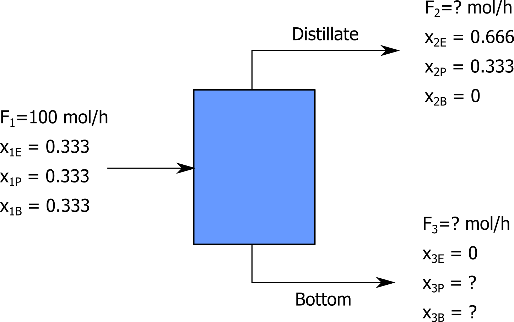

### Computer Modelling in Chemical Technology, 2020 Edition

## Class 03 - Mass balance under steady-state conditions, 11 May - 17 May

### Introduction

Please remind yourself the definition of mass and mole fraction:

https://en.wikipedia.org/wiki/Mass_fraction_(chemistry)

https://en.wikipedia.org/wiki/Mole_fraction

These relations are very useful in construction of mass balances.

Watch the materials:

https://www.youtube.com/watch?v=10qbOTikL1k

https://www.youtube.com/watch?v=UGVEtzgR0lw

https://github.com/sbednarz/scilab/blob/master/02/README.md

#### Example 1

Watch the video material: https://www.youtube.com/watch?v=KrrZB5LvXF4 and study example 2.2 https://github.com/sbednarz/scilab/blob/master/02/README.md#example-22 

Solve the equations system (eq. 1-3) https://youtu.be/KrrZB5LvXF4?t=174 using Scilab and fsolve function (note: it is a set of linear equations, so other approaches to solve the system are possible). Check your results https://youtu.be/KrrZB5LvXF4?t=306

#### Example 2

Watch the video material: https://www.youtube.com/watch?v=DsZ4p_mHSPg try to solve the system of equations numerically using Scilab:
https://youtu.be/DsZ4p_mHSPg?t=441 Verify your results: https://youtu.be/DsZ4p_mHSPg?t=527

### Exercise 1

A feed rate of 100 mol/h of an equimolar mixture of ethanol (E), propanol (P), and butanol (B) is separated in a distillation column. The distillate contains 0.66 mol ethanol and no butanol, and the bottom stream is free of ethanol. Calculate the flow rates and compositions of the distillate and bottom streams.

Please develop and send back the Scilab script (.sce) calculating the problem as your answer.

### Exercise 2

test
