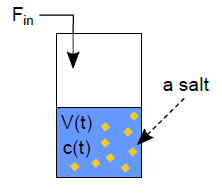
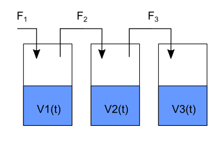

### Computer Modelling in Chemical Technology, 2020 Edition

## Mass balance under non-steady-state conditions, 8 Jun - 14 Jun

#### Introduction

We have already learnt about different the use cases of well-known material balace equation: 

accumulation = in - out ± reaction.

Class03 - accumulation was equal to 0, there was no reaction, so we used the equation in a simplified, algebraic form: 

0 = in - out

Class06 - there was reaction(s) and accumulation was not equal to 0, but the system was closed (in, out = 0), so we used the equation in a form: 

accumulation = ± reaction 

(note: accumulation means e.g. rate of production of a reaction product P, dP/dt).

This module focuses on mass balance under non-steady-state conditions without reaction, i.e. accumulation, in, out ≠ 0:

accumulation = in - out

#### Example 1

A tank is filled at a flow rate of Fin = 10 L/min. Volumetric flow rate from the tank is Fout = 1 L/min. Plot
volume of a liquid in the tank versus time from 0 to 60 min assuming that densities (rho) of inlet and outlet flows
are the same (and do not depend on the process time) and initially the tank is empty.


Solution

The following equation is a mass balance that can be applied to any system without chemical reaction:

accumulation = in - out

Thus for our system we have:

dm/dt = d(rhoV)/dt = rhoFin - rhoFout

Because the density is constant (rho(t)=const):

dV/dt = Fin - Fout [1]

Note that the system is in unsteady state (accumulation term is not equal to zero). In the script we are going to
solve the ordinary differential equation [1] with the initial conditions 𝑉(𝑡 = 0) = 0 numerically (ode function).

```scilab


function dy = model(t, y)
	V = y(1)
	dVdt = Fin - Fout
	dy=[dVdt]
endfunction

// initial conditions
V0 = 0 //L - empty tank
y0 = [V0]
t0 = 0

//other process parameters
Fin=10 //L/min
Fout=1 //L/min

t = linspace(0,60) // time span in minutes

y = ode(y0, t0, t, model) // numerical integration of ODE

//results post-processing

//V(t)
V=y(1,:)   // first row

plot(t, V, '-r')
legend(['V'])
xlabel('Time, min')
ylabel('Volume,L')
```

#### Example 2

A tank containing initially 10 mol of a salt is filled by a solvent at a flow rate of Fin = 10 L/min. Plot volume of the solvent and molar concentration of the salt in the tank versus time from 0 to 5 min assuming that density of the solvent and the solution and are the same (and do not depend on the process time) and initially the tank contains 1L of the solvent.



```scilab
function dy = model(t, y)
	V = y(1)
	dVdt = Fin
	dy=[dVdt]
endfunction

// initial conditions
V0 = 1 //L - initial volume of the solvent in the tank
y0 = [V0]
t0 = 0

//other process parameters
Fin=10 //L/min
n0=10 //mol of the salt (n0 does not depend on the time)


t = linspace(0,5) // time span in minutes

y = ode(y0, t0, t, model) // numerical integration of ODE

//results post-processing

//V(t)
V=y(1,:)   // first row

//now we could calculate molar concentration of the salt

// note "./" means element-by-element division, 
// normal operator "/" does not work in this case, because V is a vector

c = n0 ./ V 

subplot(211)
plot(t, V, '-b')
legend(['V'])
xlabel('Time, min')
ylabel('Volume, L')

subplot(212)
plot(t, c, '-r')
legend(['c'])
xlabel('Time, min')
ylabel('c, mol/L')
```
The solution:


### Exercise 1
Modify script from Examaple 1. Consider a case when the tank contains initially 400 L of a liquid, and Fin = 1 L/min and Fout = 10 L/min for t from 0 to 60 min. Look at the plot - at what time the calculation loses physical sense?

### Exercise 2

A system of connected taks is filling by a liquid. Plot volume of the liquid in each tank for time from 0 to 1 h, knowing that initially each tank contains 5 L of the liquid and F1 = 10 L/h F2 = 5 L/h and F3 = 4 L/h. Hint: three unknowns, three balance equations in ODE system.




### Exercise 3

An evaporator is initially filled by 100 L of a solution of substance A at a concentration of 1 mol/L. Assuming
a solvent evaporation rate of 50 L/h plot volume of the solution and molar concentration of A versus evaporation time from 0 to 1 h. Hint: what is number of moles of A during the process?

